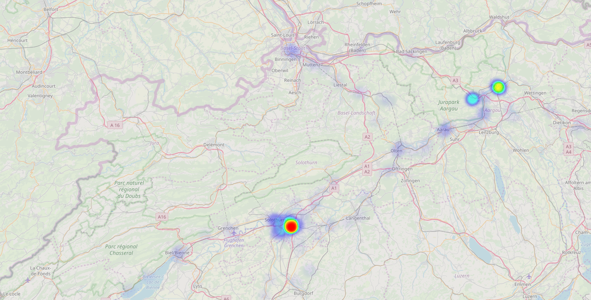
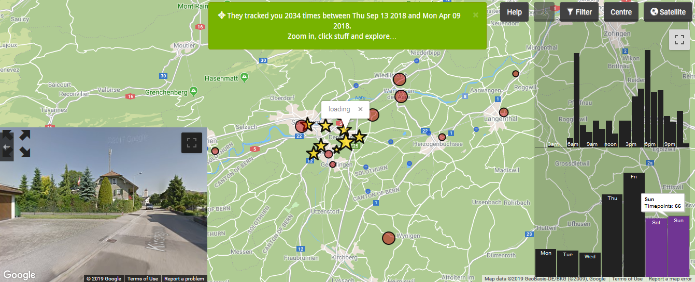

# Swisscom Vorratsdaten Analyse

---

[](https://www.python.org/)

Tools zur Analyse der eigenen Vorratsdaten, die man von der Swisscom per Datenauskunftsbegehren verlangen kann.


Visualisierung der Location History als Heatmap mit [locationhistoryvisualizer.com/heatmap](https://locationhistoryvisualizer.com/heatmap/)


Detailiertere Ansichten sind durch die Analyse des Zeitstempels möglich: [theyhaveyour.info](http://theyhaveyour.info/)

---

### Wie komme ich an die Daten?

[Nach Urteil: Swisscom ermöglicht Einblick in die eigenen Vorratsdaten der letzten 6 Monate](https://steigerlegal.ch/2018/05/04/swisscom-auskunft-vorratsdatenspeicherung/)

[Mustervorlage für Datenauskunftsbegehren zu den Daten aus der Vorratsdatenspeicherung](https://www.digitale-gesellschaft.ch/2018/03/29/mustervorlage-fuer-datenauskunftsbegehren-zu-den-daten-aus-der-vorratsdatenspeicherung-datenschutz/)

---

### Ausführen des Scripts

Von der Swisscom erhält man eine Datei, die in etwa `079*******_HD_28_NA.csv` heisst. Um diese Datei geht es hier primär. Zuerst **muss die erste Zeile in der Datei gelöscht werden**.

Erstellen einer JSON Datei mit genaueren Positionsdaten. Hierzu wird eine Geocoding API im Hintergrund verwendet.

```bash
python csv2json.py -i 079*******_HD_28_NA.csv -o vorratsdaten.json --api-key <api-key>
```

Jetzt kann noch eine separate Datei erstellt werden, die nur die Koordinaten und den Zeitstempel in einem Google-kompatiblen Format enthält. Diese Datei lässt sich dann durch Tools von Dritten analysieren.

```bash
python GoogleTakeoutConverter.py -i vorratsdaten.json -o LocationHistory.json
```

---

### Geocoding

Auflösung der Adresse in Koordinaten (Geocoding)

[opencagedata.com/](https://opencagedata.com/)

Damit das script funktioniert, wird ein kostenloser Account mit einem API-Key benötigt.

---


